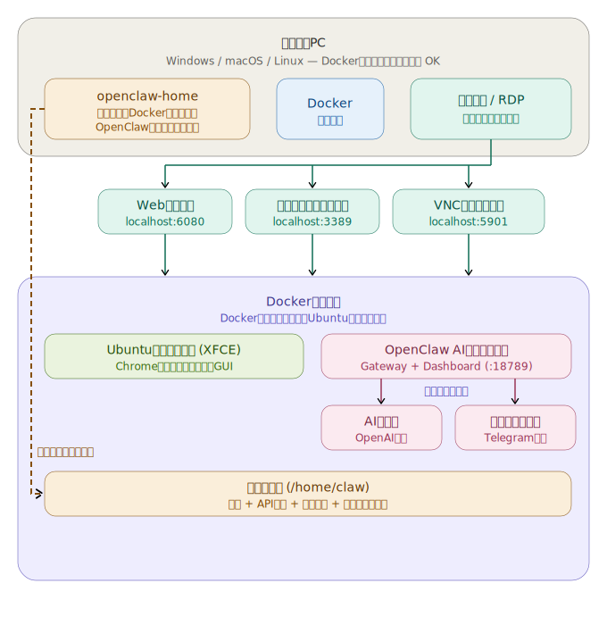

🌐 [English](README.md) | [한국어](README.ko.md) | [中文](README.zh.md) | [日本語](README.ja.md)

# OpenClaw Docker デスクトップ環境

Webブラウザ（NoVNC）、RDP、またはVNC経由でアクセス可能な完全なUbuntu 24.04 GUIデスクトップ内で[OpenClaw](https://openclaw.ai/)を実行するための、すぐに使えるDocker環境です。

Node.js 22、OpenClaw、Google Chrome、デフォルトのGateway設定がすべてプリインストールされています。初回起動時にGatewayが自動的に開始されるので、AIモデルを設定するだけですぐに使用できます。

[](https://buymeacoffee.com/neoplanetz) [](https://ctee.kr/place/neoplanetz)

<p>
  
  
</p>

> **Dockerが初めてですか？** スクリーンショット付きの[完全初心者ガイド](docs/GUIDE_FOR_BEGINNERS.ja.md)をご覧ください。

> ⚠️ **セキュリティに関する注意**
> デフォルトパスワード（`claw1234`）はこの README に公開されています。デフォルトではポートは `127.0.0.1` のみにバインドされるため、ホスト PC からのみアクセス可能です — ローカル利用では安全です。
> LAN やインターネットに公開する前に、**必ず `.env` の `CLAW_PASSWORD` を変更**し、`docker-compose.yml` のポートマッピングブロックを確認してください。

## アーキテクチャ

<p align="center">
  
</p>

## 含まれるコンポーネント

| コンポーネント | 詳細 |
|-----------|---------|
| **ベースOS** | Ubuntu 24.04 |
| **デスクトップ** | XFCE4（韓国語 + CJK + 絵文字フォント付き） |
| **リモートアクセス** | TigerVNC + NoVNC（Web）、xRDP（リモートデスクトップ）、VNC |
| **ブラウザ** | Google Chrome（デフォルト、`--no-sandbox`ラッパー） |
| **ランタイム** | Node.js 22（NodeSource） |
| **OpenClaw** | npmの最新版、デフォルト設定済み、Gateway自動起動、スキルインストール用ユーザーローカルnpm prefix |
| **デスクトップショートカット** | OpenClawセットアップ、ダッシュボード、ターミナル |

## ポート

| ポート | サービス |
|------|---------|
| `6080` | NoVNC — Webブラウザでデスクトップにアクセス |
| `5901` | VNC — VNCクライアントで直接接続 |
| `3389` | RDP — Windowsリモートデスクトップ / Remmina |
| `18789` | OpenClaw Gateway & ダッシュボード |

## クイックスタート

### 前提条件

- Docker Engine 20+

### Docker Hub から実行（推奨）

```bash
docker compose up -d
```

または単独実行（ループバックのみ — 安全なデフォルト）：
```bash
docker pull neoplanetz/openclaw-desktop-docker:latest
docker run -d --name openclaw-desktop \
  -p 127.0.0.1:6080:6080 -p 127.0.0.1:5901:5901 \
  -p 127.0.0.1:3389:3389 -p 127.0.0.1:18789:18789 \
  --shm-size=2g --security-opt seccomp=unconfined \
  neoplanetz/openclaw-desktop-docker:latest
# LAN に公開する場合は、まず -e PASSWORD=<強力なパスワード> を設定した上で、
# 上記の -p オプションから 127.0.0.1: の接頭辞を削除してください。
```

### ソースからビルド

イメージを自分でビルドする場合：
```bash
docker compose up -d --build
```

## デスクトップへの接続

### Webブラウザ（NoVNC）

`http://localhost:6080/vnc.html`を開き、VNCパスワードを入力してください（デフォルト：`claw1234`、`.env`ファイルで変更可能）。

### RDP（リモートデスクトップ）

任意のRDPクライアントで`localhost:3389`に接続してください：
- **Windows**：`mstsc`
- **macOS**：Microsoft Remote Desktop
- **Linux**：Remmina

設定したユーザー名とパスワードでログインしてください（デフォルト：`claw` / `claw1234`、`.env`ファイルで変更可能）。ドメインは空欄のまま。

### VNCクライアント

任意のVNCビューアで`localhost:5901`に接続してください。

## OpenClawセットアップ

### 仕組み（手動インストール不要）

Dockerイメージには、Node.js 22、OpenClaw、および最小限の`~/.openclaw/openclaw.json`設定が含まれています。コンテナ起動時にエントリポイントが以下を実行します：

1. VNC、NoVNC、xRDPサーバーを起動
2. OpenClaw設定ファイルの存在を確認（欠落時は再生成）
3. `openclaw-sync-display`を実行してDISPLAY / XAUTHORITYターゲティングを構成（VNC vs xRDPセッションを自動検出）し、`~/.openclaw/.env`に`OPENCLAW_ALLOW_INSECURE_PRIVATE_WS=1`を設定
4. バックグラウンドでOpenClaw Gatewayを起動（`openclaw gateway run`）
5. ChromeをXFCEのデフォルトWebブラウザに設定
6. VNC ↔ RDPセッション切替時にディスプレイを自動同期する`.bashrc`フックをインストール
7. ユーザー書き込み可能prefix（`/var/openclaw-npm`）の`.npmrc`が存在することを確認 — `npm install -g`がroot不要で動作（clawhubおよびスキル依存関係のインストール用）。prefixが`/home`の外にあるため、コンテナ再作成時にインストール済みスキルはリセットされ、ユーザーがインストールした古い openclaw がイメージに焼き込まれた版を覆い隠す問題を防ぎます。

Dockerにはsystemdがないため、オンボーディング中のGatewayデーモンインストールステップは失敗します — **これは想定通りであり、安全に無視できます**。エントリポイントがGatewayプロセスを直接管理します。

### デスクトップショートカット

XFCEデスクトップに3つのアイコンが配置されます：

| アイコン | 機能 |
|------|-------------|
| **OpenClaw Setup** | `openclaw onboard`を実行 — AIモデル/認証、チャンネル（Telegram、Discordなど）、スキルを設定します。最後のGatewayデーモンインストール失敗は正常です。 |
| **OpenClaw Dashboard** | `openclaw dashboard`を実行 — 正しい`localhost` URLと自動ログイントークンでChromeを開きます。 |
| **OpenClaw Terminal** | `openclaw` CLIが使えるXFCEターミナルを開きます。 |

### 初回AIモデル設定

デスクトップの**「OpenClaw Setup」**をダブルクリックしてください。オンボーディングウィザードが以下を案内します：

1. **モデル / 認証** — プロバイダーを選択（OpenAI Codex OAuth、Anthropic APIキーなど）
2. **チャンネル** — Telegram、Discord、WhatsAppを接続またはスキップ
3. **スキル** — 推奨スキルをインストールまたはスキップ
4. **Gatewayデーモン** — 失敗します（systemdなし）— 無視してください

ウィザード完了後、Gatewayが自動的に再起動し、ダッシュボードが開きます。

#### OpenAI Codex OAuth（ChatGPTサブスクリプション）

ChatGPT Plus/Proサブスクリプションをお持ちの場合、オンボーディング中に**「OpenAI Codex (ChatGPT OAuth)」**を選択してください。ブラウザウィンドウが開き、OpenAIアカウントにログインします。認証後、モデルが自動的に設定されます。

またはターミナルで直接実行：
```bash
openclaw models auth login --provider openai-codex --set-default
```

#### Anthropic APIキー

```bash
openclaw config set agents.defaults.model.primary anthropic/claude-sonnet-4-6
echo 'ANTHROPIC_API_KEY=sk-ant-...' >> ~/.openclaw/.env
```

#### OpenAI APIキー

```bash
openclaw config set agents.defaults.model.primary openai/gpt-4o
echo 'OPENAI_API_KEY=sk-...' >> ~/.openclaw/.env
```

### Gateway管理

```bash
openclaw status              # 全体ステータス
openclaw gateway status      # Gatewayステータス
openclaw models status       # モデル/認証ステータス
openclaw config get          # 現在の設定を表示
openclaw dashboard           # 自動ログイントークンでダッシュボードを開く
```

## 設定

### デフォルト `openclaw.json`

`~/.openclaw/openclaw.json`にプリセット：

```json5
{
  gateway: {
    mode: "local",
    port: 18789,
    bind: "lan",
    controlUi: {
      allowedOrigins: ["*"],
    },
  },
  browser: {
    enabled: false,
    defaultProfile: "openclaw",
    noSandbox: true,
  },
  plugins: {
    entries: {
      browser: {
        enabled: true,
      },
    },
  },
  agents: {
    defaults: {
      workspace: "~/.openclaw/workspace",
    },
  },
  env: {
    vars: {
      TZ: "Asia/Seoul",
    },
  },
}
```

- `bind: "lan"` — すべてのインターフェースでリッスンし、ホストが`http://localhost:18789/`にアクセス可能
- `controlUi.allowedOrigins: ["*"]` — 任意のオリジンからのダッシュボードアクセスを許可（Docker内部で必要）
- `browser.enabled: false` — CDPブラウザはデフォルトで無効；`.env`で`OPENCLAW_BROWSER_ENABLED=true`に設定して有効化
- `browser.defaultProfile` / `browser.noSandbox` — 専用の`openclaw` Chromeプロファイルを使用し、サンドボックスを無効化（Docker内部で必要）
- `plugins.entries.browser.enabled: true` — ブラウザプラグインが登録され、ブラウザ有効時にエージェントがブラウザツールを使用可能
- デフォルトではAIモデルは設定されていません — オンボーディングまたはCLIで設定してください

### ユーザー名とパスワードの変更

プロジェクトルート（`docker-compose.yml`と同じディレクトリ）にある`.env`ファイルを編集してください：

```env
CLAW_USER=myname
CLAW_PASSWORD=mypassword
```

そして再ビルドします：
```bash
docker compose up -d --build
```

> 以前の実行後にユーザー名を変更する場合は、まず古いボリュームを削除してください：
> `docker compose down -v && docker compose up -d --build`

### 環境変数

`.env`ファイルを通じて`docker-compose.yml`で自動的に設定されます：

| `.env`変数 | コンテナ環境変数 | デフォルト | 説明 |
|----------|---------|---------|-------------|
| `CLAW_USER` | `USER` | `claw` | Linuxユーザー名 |
| `CLAW_PASSWORD` | `PASSWORD` | `claw1234` | VNC / RDP / sudoパスワード |
| `OPENCLAW_VERSION` | *（ビルド引数）* | `latest` | OpenClaw npmパッケージバージョン（例：`latest`、`2026.3.28`）— `docker compose build`時に使用 |
| — | `VNC_RESOLUTION` | `1920x1080` | デスクトップ解像度 |
| — | `VNC_COL_DEPTH` | `24` | 色深度 |
| — | `TZ` | `Asia/Seoul` | タイムゾーン |
| — | `OPENCLAW_ALLOW_INSECURE_PRIVATE_WS` | `1` | Docker内部のプライベートIPへのプレーンテキスト`ws://`を許可（[詳細](#docker固有の回避策)） |
| `OPENCLAW_BROWSER_ENABLED` | `OPENCLAW_BROWSER_ENABLED` | `false` | OpenClaw CDPブラウザを有効化（Chromeプロファイル：`openclaw`、`--no-sandbox`） |
| `OPENCLAW_DISPLAY_TARGET` | `OPENCLAW_DISPLAY_TARGET` | `auto` | ディスプレイターゲティングポリシー：`auto`、`vnc`、`rdp` |
| — | `OPENCLAW_X_DISPLAY` | — | DISPLAYのハードオーバーライド（例：`:1`、`:10`） |
| — | `OPENCLAW_X_AUTHORITY` | — | XAUTHORITYパスのハードオーバーライド |

## データの永続化

`openclaw-home`名前付きボリュームが設定されたユーザーのホームディレクトリにマウントされます（デフォルト：`/home/claw`）。以下が保持されます：

- OpenClaw設定、認証情報、会話履歴
- Chromeプロファイルとブックマーク
- デスクトップのカスタマイズ
- SSHキー、シェル履歴など

`docker compose down` / `up`後もデータは保持されます。`docker volume rm openclaw-home`のみがデータを削除します。

> **永続化されない**: npmグローバルprefixはホームボリュームの外（`/var/openclaw-npm`）にあるため、`clawhub`または`npm install -g`でインストールしたパッケージはコンテナ再作成時にリセットされます。これは意図的な動作で、アップグレード時にユーザーがインストールした古い`openclaw`がイメージに焼き込まれた版を覆い隠すのを防ぎます。再作成後はスキルを再インストールしてください。

## Docker固有の回避策

このセットアップには、Docker内でフルGUI + ブラウザ + OpenClawを実行するためのいくつかの回避策が含まれています：

| 問題 | 解決策 |
|-------|----------|
| systemdなし | エントリポイントがVNC、xRDP、Gatewayプロセスを直接管理 |
| Chromeにサンドボックスが必要 | ラッパースクリプトがすべての起動に`--no-sandbox`を追加 |
| `xdg-open`がDocker内部IPを使用 | ラッパーが`172.x.x.x` / `10.x.x.x` URLを`localhost`に書き換え |
| ブラウザがターミナルから切り離される | xdg-openラッパーの`setsid`がターミナル終了時のSIGHUPを防止 |
| Chromeプロファイルのロック競合 | コンテナ起動時に古い`SingletonLock`ファイルをクリーンアップ |
| XFCEデフォルトブラウザ | 起動ごとにカスタムexo-helper + `mimeapps.list`を設定 |
| VNCパスワード（`vncpasswd`なし） | 3段階フォールバック：`vncpasswd`バイナリ → `openssl` → 純粋なPython DES |
| DockerでFirefox snapが動作しない | Google Chrome debパッケージに置き換え |
| Gatewayヘルスチェックが非ループバック`ws://`をブロック | `OPENCLAW_ALLOW_INSECURE_PRIVATE_WS=1`でRFC 1918プライベートIPへのプレーンテキスト`ws://`を許可（Docker内部ネットワークのみ、[v2026.2.19で追加](https://github.com/openclaw/openclaw/pull/28670)） |
| VNC↔RDPディスプレイ不一致 | `openclaw-sync-display`ヘルパーがアクティブセッションを自動検出（VNC `:1` vs xRDP `:10+`）、正しいDISPLAYでGatewayを再起動；`.bashrc`フックで切替を検知 |
| `npm install -g`にrootが必要 | `.npmrc`で`prefix=/var/openclaw-npm`（`/home`の外）を設定 — グローバルインストールがユーザー書き込み可能ディレクトリに移動し、再作成時にリセット；`.bashrc`でPATHをエクスポート |

## トラブルシューティング

### コンテナが再起動を繰り返す
```bash
docker compose logs openclaw-desktop
```
VNC起動または設定検証のエラーを確認してください。

### NoVNCに空白画面が表示される
```bash
# .envでCLAW_USERを変更した場合は'claw'を該当ユーザー名に置き換えてください
docker exec -it openclaw-desktop bash
su - claw -c "vncserver -kill :1"
su - claw -c "vncserver :1 -geometry 1920x1080 -depth 24 -localhost no"
```

### RDPに白い画面が表示される
```bash
docker exec -it openclaw-desktop /etc/init.d/xrdp restart
```

### OpenClaw Gatewayが動作していない
```bash
# .envでCLAW_USERを変更した場合は'claw'を該当ユーザー名に置き換えてください
docker exec -u claw openclaw-desktop openclaw status
# 手動再起動：
docker exec -u claw openclaw-desktop bash -c \
  "nohup openclaw gateway run >> ~/.openclaw/gateway.log 2>&1 & disown"
```

### オンボーディング中に「Gateway daemon install failed」
これは想定通りです — Dockerコンテナにはsystemdがありません。エントリポイントが代わりにGatewayのライフサイクルを管理します。このメッセージは無視してください。

### ダッシュボードに「control ui requires device identity」が表示される
ブラウザが`localhost`ではなくDocker内部IPで開かれました。閉じて**「OpenClaw Dashboard」**デスクトップショートカットを使用してください。正しいURLとトークンで`openclaw dashboard`を実行します。

## ファイル構成

```
openclaw-desktop-docker/
├── .env                        # ユーザー設定（CLAW_USER、CLAW_PASSWORD）
├── Dockerfile                  # Ubuntu 24.04ベースイメージ
├── docker-compose.yml          # Compose設定
├── entrypoint.sh               # ランタイム：VNC、xRDP、Chrome設定、Gateway
├── README.md                   # ドキュメント（EN、KO、ZH、JA）
├── assets/                     # 画像 & アーキテクチャ図
│   ├── architecture_*.svg
│   ├── dockerized_openclaw.png
│   └── openclaw_desktop_web.png
├── configs/                    # 設定テンプレート（ビルド/ランタイム時にコピー）
│   ├── vnc/xstartup            # VNCセッション起動
│   ├── xrdp/startwm.sh        # xRDPセッション起動
│   ├── xrdp/reconnectwm.sh    # xRDP再接続フック
│   └── ...
├── scripts/                    # ヘルパースクリプト
│   └── openclaw-sync-display   # ポリシーベースX11ディスプレイターゲティング
└── docs/                       # ガイド & 変更履歴
    ├── CHANGELOG.md
    ├── DOCKERHUB_OVERVIEW.md
    ├── GUIDE_FOR_BEGINNERS.*.md
    └── images/                 # ガイドスクリーンショット
```
