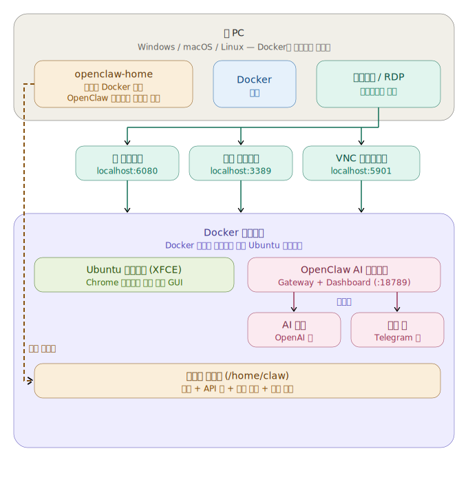

🌐 [English](README.md) | [한국어](README.ko.md) | [中文](README.zh.md) | [日本語](README.ja.md)

# OpenClaw Docker 데스크톱 환경

웹 브라우저(NoVNC), RDP 또는 VNC를 통해 접속 가능한 Ubuntu 24.04 GUI 데스크톱 안에서 [OpenClaw](https://openclaw.ai/)를 실행하는 올인원 Docker 환경입니다.

Node.js 22, OpenClaw, Google Chrome, 기본 Gateway 설정이 모두 사전 설치되어 있습니다. 첫 부팅 시 Gateway가 자동으로 시작되므로, AI 모델만 설정하면 바로 사용할 수 있습니다.

[](https://buymeacoffee.com/neoplanetz) [](https://ctee.kr/place/neoplanetz)

<p>
  
  
</p>

> **Docker가 처음이신가요?** 스크린샷과 함께 하나하나 따라할 수 있는 [완전 초보자 가이드](docs/GUIDE_FOR_BEGINNERS.ko.md)를 확인해 보세요.

> ⚠️ **보안 안내**
> 기본 비밀번호(`claw1234`)는 이 README에 공개되어 있습니다. 기본 설정에서는 포트가 `127.0.0.1`에만 바인딩되므로 호스트 PC에서만 접근 가능합니다 — 로컬 사용에 안전합니다.
> LAN이나 인터넷에 노출하기 전에는 **반드시 `.env`의 `CLAW_PASSWORD`를 변경**하고 `docker-compose.yml`의 포트 매핑 블록을 확인하세요.

## 아키텍처

<p align="center">
  
</p>

## 포함 구성 요소

| 구성 요소 | 세부 사항 |
|-----------|---------|
| **기본 OS** | Ubuntu 24.04 |
| **데스크톱** | XFCE4 (한국어 + CJK + 이모지 폰트 포함) |
| **원격 접속** | TigerVNC + NoVNC (웹), xRDP (원격 데스크톱), VNC |
| **브라우저** | Google Chrome (기본, `--no-sandbox` 래퍼) |
| **런타임** | Node.js 22 (NodeSource) |
| **OpenClaw** | npm 최신 버전, 기본 설정 사전 구성, Gateway 자동 시작, 스킬 설치를 위한 사용자 로컬 npm prefix |
| **바탕화면 바로가기** | OpenClaw 설정, 대시보드, 터미널 |

## 포트

| 포트 | 서비스 |
|------|---------|
| `6080` | NoVNC — 웹 브라우저로 데스크톱 접속 |
| `5901` | VNC — VNC 클라이언트 직접 연결 |
| `3389` | RDP — Windows 원격 데스크톱 / Remmina |
| `18789` | OpenClaw Gateway & 대시보드 |

## 빠른 시작

### 사전 요구 사항

- Docker Engine 20+

### Docker Hub에서 실행 (권장)

```bash
docker compose up -d
```

또는 단독 실행 (루프백 전용 — 안전한 기본값):
```bash
docker pull neoplanetz/openclaw-desktop-docker:latest
docker run -d --name openclaw-desktop \
  -p 127.0.0.1:6080:6080 -p 127.0.0.1:5901:5901 \
  -p 127.0.0.1:3389:3389 -p 127.0.0.1:18789:18789 \
  --shm-size=2g --security-opt seccomp=unconfined \
  neoplanetz/openclaw-desktop-docker:latest
# LAN에 노출하려면 먼저 -e PASSWORD=<강력한_비번>을 설정한 뒤,
# 위의 -p 옵션에서 127.0.0.1: 접두사를 제거하세요.
```

### 소스에서 직접 빌드

이미지를 직접 빌드하려면:
```bash
docker compose up -d --build
```

## 데스크톱 연결 방법

### 웹 브라우저 (NoVNC)

`http://localhost:6080/vnc.html`을 열고 VNC 비밀번호를 입력하세요 (기본값: `claw1234`, `.env` 파일에서 변경 가능).

### RDP (원격 데스크톱)

아무 RDP 클라이언트로 `localhost:3389`에 접속하세요:
- **Windows**: `mstsc`
- **macOS**: Microsoft Remote Desktop
- **Linux**: Remmina

설정된 사용자명과 비밀번호로 로그인하세요 (기본값: `claw` / `claw1234`, `.env` 파일에서 변경 가능). 도메인은 비워두세요.

### VNC 클라이언트

아무 VNC 뷰어로 `localhost:5901`에 접속하세요.

## OpenClaw 설정

### 작동 방식 (수동 설치 불필요)

Docker 이미지에 Node.js 22, OpenClaw, 최소 `~/.openclaw/openclaw.json` 설정이 포함되어 있습니다. 컨테이너 시작 시마다 엔트리포인트가 다음을 수행합니다:

1. VNC, NoVNC, xRDP 서버 시작
2. OpenClaw 설정 파일 존재 확인 (없으면 재생성)
3. `openclaw-sync-display` 실행으로 DISPLAY / XAUTHORITY 타겟팅 구성 (VNC vs xRDP 세션 자동 감지) 및 `~/.openclaw/.env`에 `OPENCLAW_ALLOW_INSECURE_PRIVATE_WS=1` 설정
4. 백그라운드에서 OpenClaw Gateway 시작 (`openclaw gateway run`)
5. Chrome을 XFCE 기본 웹 브라우저로 설정
6. VNC ↔ RDP 세션 전환 시 디스플레이를 자동 동기화하는 `.bashrc` 훅 설치
7. 사용자 쓰기 가능 prefix(`/var/openclaw-npm`)가 설정된 `.npmrc` 존재 확인 — `npm install -g`가 root 없이 작동 (clawhub 및 스킬 의존성 설치용). prefix가 `/home` 외부에 있어 컨테이너 재생성 시 설치된 스킬이 초기화되며, 이미지에 baked된 openclaw 버전이 사용자가 설치한 구버전에 가려지는 문제를 방지합니다.

이 이미지에는 `systemctl` 셰비가 포함되어 있어 OpenClaw의 systemd-user 호출을 프로세스 관리로 변환합니다. 따라서 `openclaw update`, `openclaw gateway restart` 및 대시보드의 동일 기능이 모두 깔끔하게 완료됩니다. Gateway unit 파일은 첫 부팅 시 자동 등록되므로 수동으로 `openclaw gateway install`을 실행할 필요가 없습니다.

### 바탕화면 바로가기

XFCE 바탕화면에 세 개의 아이콘이 배치됩니다:

| 아이콘 | 기능 |
|------|-------------|
| **OpenClaw Setup** | `openclaw onboard` 실행 — AI 모델/인증, 채널(Telegram, Discord 등), 스킬을 구성합니다. 마지막에 Gateway 데몬 설치 실패는 정상입니다. |
| **OpenClaw Dashboard** | `openclaw dashboard` 실행 — 올바른 `localhost` URL과 자동 로그인 토큰으로 Chrome을 엽니다. |
| **OpenClaw Terminal** | `openclaw` CLI가 준비된 XFCE 터미널을 엽니다. |

### 최초 AI 모델 설정

바탕화면의 **"OpenClaw Setup"**을 더블클릭하세요. 온보딩 마법사가 다음을 안내합니다:

1. **모델 / 인증** — 제공자 선택 (OpenAI Codex OAuth, Anthropic API 키 등)
2. **채널** — Telegram, Discord, WhatsApp 연결 또는 건너뛰기
3. **스킬** — 추천 스킬 설치 또는 건너뛰기
4. **Gateway 데몬** — systemctl 셰비를 통해 깔끔하게 설치됨

마법사가 완료되면 자동으로 Gateway를 재시작하고 대시보드를 엽니다.

#### OpenAI Codex OAuth (ChatGPT 구독)

ChatGPT Plus/Pro 구독이 있다면, 온보딩 중 **"OpenAI Codex (ChatGPT OAuth)"**를 선택하세요. 브라우저 창이 열리면 OpenAI 계정으로 로그인합니다. 인증 후 모델이 자동 설정됩니다.

또는 터미널에서 직접 실행:
```bash
openclaw models auth login --provider openai-codex --set-default
```

#### Anthropic API 키

```bash
openclaw config set agents.defaults.model.primary anthropic/claude-sonnet-4-6
echo 'ANTHROPIC_API_KEY=sk-ant-...' >> ~/.openclaw/.env
```

#### OpenAI API 키

```bash
openclaw config set agents.defaults.model.primary openai/gpt-4o
echo 'OPENAI_API_KEY=sk-...' >> ~/.openclaw/.env
```

### Gateway 관리

```bash
openclaw status              # 전체 상태
openclaw gateway status      # Gateway 상태
openclaw models status       # 모델/인증 상태
openclaw config get          # 현재 설정 보기
openclaw dashboard           # 자동 로그인 토큰으로 대시보드 열기
```

## 설정

### 기본 `openclaw.json`

`~/.openclaw/openclaw.json`에 사전 구성:

```json5
{
  gateway: {
    mode: "local",
    port: 18789,
    bind: "lan",
    controlUi: {
      allowedOrigins: ["*"],
    },
  },
  browser: {
    enabled: false,
    defaultProfile: "openclaw",
    noSandbox: true,
  },
  plugins: {
    entries: {
      browser: {
        enabled: true,
      },
    },
  },
  agents: {
    defaults: {
      workspace: "~/.openclaw/workspace",
    },
  },
  env: {
    vars: {
      TZ: "Asia/Seoul",
    },
  },
}
```

- `bind: "lan"` — 모든 인터페이스에서 수신하여 호스트가 `http://localhost:18789/`에 접근 가능
- `controlUi.allowedOrigins: ["*"]` — 모든 오리진에서 대시보드 접근 허용 (Docker 내부에서 필요)
- `browser.enabled: false` — CDP 브라우저는 기본 비활성화; `.env`에서 `OPENCLAW_BROWSER_ENABLED=true`로 활성화
- `browser.defaultProfile` / `browser.noSandbox` — 전용 `openclaw` Chrome 프로필을 사용하고, Docker 내에서 필요한 샌드박스 비활성화 설정
- `plugins.entries.browser.enabled: true` — 브라우저 플러그인이 등록되어 브라우저 활성화 시 에이전트가 브라우저 도구 사용 가능
- 기본적으로 AI 모델은 설정되어 있지 않음 — 온보딩 또는 CLI로 설정하세요

### 사용자명 & 비밀번호 변경

프로젝트 루트(`docker-compose.yml`과 같은 디렉토리)에 있는 `.env` 파일을 수정하세요:

```env
CLAW_USER=myname
CLAW_PASSWORD=mypassword
```

그 다음 재빌드합니다:
```bash
docker compose up -d --build
```

> 이전에 사용한 사용자명을 변경할 경우, 기존 볼륨을 먼저 삭제해야 합니다:
> `docker compose down -v && docker compose up -d --build`

### 환경 변수

`.env` 파일을 통해 `docker-compose.yml`에서 자동으로 설정됩니다:

| `.env` 변수 | 컨테이너 환경변수 | 기본값 | 설명 |
|----------|---------|---------|-------------|
| `CLAW_USER` | `USER` | `claw` | Linux 사용자명 |
| `CLAW_PASSWORD` | `PASSWORD` | `claw1234` | VNC / RDP / sudo 비밀번호 |
| `OPENCLAW_VERSION` | *(빌드 인자)* | `latest` | OpenClaw npm 패키지 버전 (예: `latest`, `2026.3.28`) — `docker compose build` 시 사용 |
| — | `VNC_RESOLUTION` | `1920x1080` | 데스크톱 해상도 |
| — | `VNC_COL_DEPTH` | `24` | 색 심도 |
| — | `TZ` | `Asia/Seoul` | 시간대 |
| — | `OPENCLAW_ALLOW_INSECURE_PRIVATE_WS` | `1` | Docker 내부 사설 IP에 대한 plaintext `ws://` 허용 ([상세](#docker-관련-우회-방법)) |
| `OPENCLAW_BROWSER_ENABLED` | `OPENCLAW_BROWSER_ENABLED` | `false` | OpenClaw CDP 브라우저 활성화 (Chrome 프로필: `openclaw`, `--no-sandbox`) |
| `OPENCLAW_DISPLAY_TARGET` | `OPENCLAW_DISPLAY_TARGET` | `auto` | 디스플레이 타겟팅 정책: `auto`, `vnc`, `rdp` |
| — | `OPENCLAW_X_DISPLAY` | — | DISPLAY 하드 오버라이드 (예: `:1`, `:10`) |
| — | `OPENCLAW_X_AUTHORITY` | — | XAUTHORITY 경로 하드 오버라이드 |

## 데이터 영속성

`openclaw-home` 네임드 볼륨이 설정된 사용자의 홈 디렉토리에 마운트됩니다 (기본값: `/home/claw`). 다음이 보존됩니다:

- OpenClaw 설정, 인증 정보, 대화 기록
- Chrome 프로필 및 북마크
- 데스크톱 사용자 지정
- SSH 키, 셸 히스토리 등

`docker compose down` / `up` 후에도 데이터가 유지됩니다. `docker volume rm openclaw-home`만이 데이터를 삭제합니다.

> **영속되지 않음**: npm 글로벌 prefix는 홈 볼륨 외부의 `/var/openclaw-npm`에 있으므로, `clawhub` 또는 `npm install -g`로 설치한 패키지는 컨테이너 재생성 시 초기화됩니다. 이는 의도된 동작으로, 업그레이드 시 사용자가 설치한 구버전 `openclaw`가 이미지에 baked된 버전을 가리는 문제를 방지합니다. 재생성 후 스킬을 다시 설치하세요.

## Docker 관련 우회 방법

이 환경에는 Docker 안에서 전체 GUI + 브라우저 + OpenClaw를 실행하기 위한 여러 우회 방법이 포함되어 있습니다:

| 문제 | 해결 방법 |
|-------|----------|
| systemd 없음 | 엔트리포인트가 VNC, xRDP, Gateway 프로세스를 직접 관리 |
| Chrome 샌드박스 필요 | 래퍼 스크립트가 모든 실행에 `--no-sandbox` 추가 |
| `xdg-open`이 Docker 내부 IP 사용 | 래퍼가 `172.x.x.x` / `10.x.x.x` URL을 `localhost`로 변환 |
| 브라우저가 터미널에서 분리 | xdg-open 래퍼의 `setsid`가 터미널 종료 시 SIGHUP 방지 |
| Chrome 프로필 잠금 충돌 | 컨테이너 시작 시 오래된 `SingletonLock` 파일 정리 |
| XFCE 기본 브라우저 | 매 시작 시 커스텀 exo-helper + `mimeapps.list` 설정 |
| VNC 비밀번호 (`vncpasswd` 없음) | 3단계 폴백: `vncpasswd` 바이너리 → `openssl` → 순수 Python DES |
| Docker에서 Firefox snap 미작동 | Google Chrome deb 패키지로 대체 |
| Gateway health check가 non-loopback `ws://` 차단 | `OPENCLAW_ALLOW_INSECURE_PRIVATE_WS=1`로 RFC 1918 사설 IP에 대한 plaintext `ws://` 허용 (Docker 내부 네트워크만 해당, [v2026.2.19에서 추가](https://github.com/openclaw/openclaw/pull/28670)) |
| VNC↔RDP 디스플레이 불일치 | `openclaw-sync-display` 헬퍼가 활성 세션을 자동 감지 (VNC `:1` vs xRDP `:10+`), 올바른 DISPLAY로 Gateway 재시작; `.bashrc` 훅으로 전환 감지 |
| `openclaw update` 후 대시보드가 계속 "업데이트 가능"으로 표시 | `systemctl` 셰비가 OpenClaw의 systemd restart 호출을 직접 프로세스 관리로 변환 — 업데이트와 재시작이 원자적으로 완료 |
| `npm install -g`에 root 필요 | `.npmrc`에 `prefix=/var/openclaw-npm` 설정 (`/home` 외부) — 글로벌 설치가 사용자 쓰기 가능 디렉토리로 이동하고 재생성 시 초기화됨; `.bashrc`에서 PATH 내보내기 |

## 문제 해결

### 컨테이너가 계속 재시작됨
```bash
docker compose logs openclaw-desktop
```
VNC 시작 또는 설정 검증 오류를 확인하세요.

### NoVNC에 빈 화면이 표시됨
```bash
# .env에서 CLAW_USER를 변경한 경우 'claw'를 해당 사용자명으로 바꾸세요
docker exec -it openclaw-desktop bash
su - claw -c "vncserver -kill :1"
su - claw -c "vncserver :1 -geometry 1920x1080 -depth 24 -localhost no"
```

### RDP에 흰 화면이 표시됨
```bash
docker exec -it openclaw-desktop /etc/init.d/xrdp restart
```

### OpenClaw Gateway가 실행되지 않음
```bash
# .env에서 CLAW_USER를 변경한 경우 'claw'를 해당 사용자명으로 바꾸세요
docker exec -u claw openclaw-desktop openclaw status
# 수동 재시작:
docker exec -u claw openclaw-desktop bash -c \
  "nohup openclaw gateway run >> ~/.openclaw/gateway.log 2>&1 & disown"
```

### 온보딩 중 "Gateway daemon install failed"
이전 버전의 이미지에서는 Docker 컨테이너에 systemd가 없어서 "systemd not available" 메시지가 뜨곤 했습니다. 현재 이미지는 셰비로 이 호출을 투명하게 처리하므로 온보딩 중 이 메시지가 보이지 않아야 합니다. 만약 보인다면 `/usr/bin/systemctl`이 `/usr/local/bin/systemctl-shim`을 가리키는 심볼릭 링크인지 확인하세요.

### 대시보드에 "control ui requires device identity" 표시
브라우저가 `localhost` 대신 Docker 내부 IP로 열렸습니다. 닫고 **"OpenClaw Dashboard"** 바탕화면 바로가기를 사용하세요. 올바른 URL과 토큰으로 `openclaw dashboard`를 실행합니다.

## 파일 구조

```
openclaw-desktop-docker/
├── .env                        # 사용자 설정 (CLAW_USER, CLAW_PASSWORD)
├── Dockerfile                  # Ubuntu 24.04 베이스 이미지
├── docker-compose.yml          # Compose 설정
├── entrypoint.sh               # 런타임: VNC, xRDP, Chrome 설정, Gateway
├── README.md                   # 문서 (EN, KO, ZH, JA)
├── assets/                     # 이미지 & 아키텍처 다이어그램
│   ├── architecture_*.svg
│   ├── dockerized_openclaw.png
│   └── openclaw_desktop_web.png
├── configs/                    # 설정 템플릿 (빌드/런타임 시 복사)
│   ├── vnc/xstartup            # VNC 세션 시작
│   ├── xrdp/startwm.sh        # xRDP 세션 시작
│   ├── xrdp/reconnectwm.sh    # xRDP 재연결 훅
│   └── ...
├── scripts/                    # 헬퍼 스크립트
│   └── openclaw-sync-display   # 정책 기반 X11 디스플레이 타겟팅
└── docs/                       # 가이드 & 체인지로그
    ├── CHANGELOG.md
    ├── DOCKERHUB_OVERVIEW.md
    ├── GUIDE_FOR_BEGINNERS.*.md
    └── images/                 # 가이드 스크린샷
```
