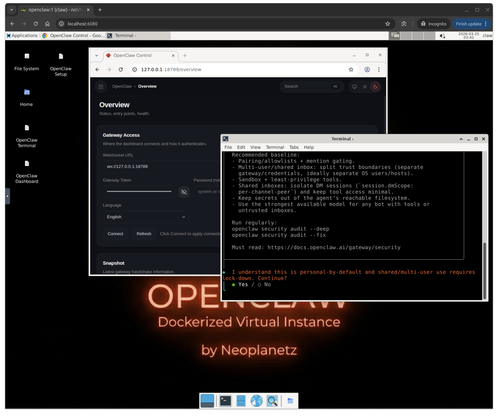
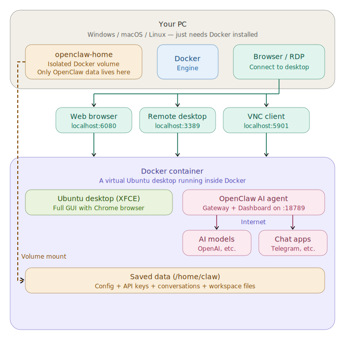

🌐 [English](README.md) | [한국어](README.ko.md) | [中文](README.zh.md) | [日本語](README.ja.md)

# OpenClaw Docker Desktop Environment

A turnkey Docker setup for running [OpenClaw](https://openclaw.ai/) inside a full Ubuntu 24.04 GUI desktop, accessible via web browser (NoVNC), RDP, or VNC.

Everything is pre-installed — Node.js 22, OpenClaw, Google Chrome, and a default Gateway config. On first boot the Gateway starts automatically; just set your AI model and go.

[](https://buymeacoffee.com/neoplanetz) [](https://ctee.kr/place/neoplanetz)

<p>
  
  
</p>

> **New to Docker?** Check out the [Beginner's Guide](docs/GUIDE_FOR_BEGINNERS.md) for step-by-step instructions with screenshots.

> ⚠️ **Security notice**
> The default password (`claw1234`) is published in this README. By default, ports are bound to `127.0.0.1` only (this host) — safe for local use.
> Before exposing to your LAN or the internet, **always change `CLAW_PASSWORD` in `.env`** and review the port-mapping block in `docker-compose.yml`.

## Architecture

<p align="center">
  
</p>

## What's Included

| Component | Details |
|-----------|---------|
| **Base OS** | Ubuntu 24.04 |
| **Architectures** | `linux/amd64`, `linux/arm64` (multi-arch manifest — Docker picks the right variant automatically) |
| **Desktop** | XFCE4 with Korean + CJK + emoji fonts |
| **Remote Access** | TigerVNC + NoVNC (web), xRDP (Remote Desktop), raw VNC |
| **Browser** | Google Chrome on amd64 / Chromium on arm64 (Google does not ship `chrome-stable` for arm64; Chromium is CDP-compatible so OpenClaw browser automation behaves identically). Both ship a `--no-sandbox` wrapper. |
| **Runtime** | Node.js 22 (NodeSource) |
| **OpenClaw** | Latest from npm, default config pre-seeded, Gateway auto-starts, user-local npm prefix for skill installs |
| **Desktop Shortcuts** | OpenClaw Setup, Dashboard, Terminal |

## Ports

| Port | Service |
|------|---------|
| `6080` | NoVNC — access the desktop via web browser |
| `5901` | VNC — direct VNC client connection |
| `3389` | RDP — Windows Remote Desktop / Remmina |
| `18789` | OpenClaw Gateway & Dashboard |

## Quick Start

### Prerequisites

- Docker Engine 20+

### Run from Docker Hub (Recommended)

```bash
docker compose up -d
```

Or standalone (loopback-only — safe default):
```bash
docker pull neoplanetz/openclaw-desktop-docker:latest
docker run -d --name openclaw-desktop \
  -p 127.0.0.1:6080:6080 -p 127.0.0.1:5901:5901 \
  -p 127.0.0.1:3389:3389 -p 127.0.0.1:18789:18789 \
  --shm-size=2g --security-opt seccomp=unconfined \
  neoplanetz/openclaw-desktop-docker:latest
# To expose on the LAN, first set -e PASSWORD=<strong>, then drop the
# 127.0.0.1: prefix from the -p flags above.
```

### Build from Source

If you want to build the image yourself:
```bash
docker compose up -d --build
```

## Connecting to the Desktop

### Web Browser (NoVNC)

Open `http://localhost:6080/vnc.html` and enter the VNC password (default: `claw1234`, configurable in `.env`).

### RDP (Remote Desktop)

Connect to `localhost:3389` with any RDP client:
- **Windows**: `mstsc`
- **macOS**: Microsoft Remote Desktop
- **Linux**: Remmina

Login with your configured username and password (default: `claw` / `claw1234`, configurable in `.env`). Leave Domain blank.

### VNC Client

Connect to `localhost:5901` with any VNC viewer.

## OpenClaw Setup

### How It Works (No Manual Install Needed)

The Docker image ships with Node.js 22, OpenClaw, and a minimal `~/.openclaw/openclaw.json` config. On every container start, the entrypoint:

1. Starts VNC, NoVNC, and xRDP servers
2. Ensures the OpenClaw config exists (regenerates if missing)
3. Runs `openclaw-sync-display` to configure DISPLAY / XAUTHORITY targeting (auto-detects VNC vs xRDP session) and writes `OPENCLAW_ALLOW_INSECURE_PRIVATE_WS=1` to `~/.openclaw/.env`
4. Starts the OpenClaw Gateway in the background (`openclaw gateway run`)
5. Sets Chrome as the default XFCE web browser
6. Installs a `.bashrc` hook that auto-syncs the display when switching between VNC and RDP sessions
7. Ensures `.npmrc` with user-writable prefix (`/var/openclaw-npm`) exists so `npm install -g` works without root (for clawhub and skill dependencies). The prefix lives outside `/home`, so installed skills are reset on container recreate — preventing stale openclaw versions from shadowing the image-baked one.

The container ships a `systemctl` shim that translates OpenClaw's systemd-user calls into direct process management, so `openclaw update` and `openclaw gateway restart` — and the equivalent dashboard flows — complete cleanly. The gateway unit file is auto-registered on first boot; no manual `openclaw gateway install` is needed.

### Desktop Shortcuts

Three icons are placed on the XFCE desktop:

| Icon | What It Does |
|------|-------------|
| **OpenClaw Setup** | Runs `openclaw onboard` — configure AI model/auth, channels (Telegram, Discord, etc.), and skills. The gateway daemon install at the end completes cleanly via the systemctl shim. |
| **OpenClaw Dashboard** | Runs `openclaw dashboard` — opens Chrome with the correct `localhost` URL and auto-login token. |
| **OpenClaw Terminal** | Opens an XFCE terminal with the `openclaw` CLI ready. |

### First-Time AI Model Setup

Double-click **"OpenClaw Setup"** on the desktop. The onboarding wizard walks through:

1. **Model / Auth** — choose a provider (OpenAI Codex OAuth, Anthropic API key, etc.)
2. **Channels** — connect Telegram, Discord, WhatsApp, or skip
3. **Skills** — install recommended skills or skip
4. **Gateway daemon** — installs cleanly via the systemctl shim

The wizard automatically restarts the Gateway and opens the Dashboard when finished.

#### OpenAI Codex OAuth (ChatGPT Subscription)

If you have a ChatGPT Plus/Pro subscription, select **"OpenAI Codex (ChatGPT OAuth)"** during onboarding. A browser window opens for you to log into your OpenAI account. After authorization, the model is set automatically.

Or run directly in the terminal:
```bash
openclaw models auth login --provider openai-codex --set-default
```

#### Anthropic API Key

```bash
openclaw config set agents.defaults.model.primary anthropic/claude-sonnet-4-6
echo 'ANTHROPIC_API_KEY=sk-ant-...' >> ~/.openclaw/.env
```

#### OpenAI API Key

```bash
openclaw config set agents.defaults.model.primary openai/gpt-4o
echo 'OPENAI_API_KEY=sk-...' >> ~/.openclaw/.env
```

### Gateway Management

```bash
openclaw status              # Overall status
openclaw gateway status      # Gateway-specific status
openclaw models status       # Model/auth status
openclaw config get          # View current config
openclaw dashboard           # Open Dashboard with auto-login token
```

## Configuration

### Default `openclaw.json`

Pre-seeded at `~/.openclaw/openclaw.json`:

```json5
{
  gateway: {
    mode: "local",
    port: 18789,
    bind: "lan",
    controlUi: {
      allowedOrigins: ["*"],
    },
  },
  browser: {
    enabled: false,
    defaultProfile: "openclaw",
    noSandbox: true,
  },
  plugins: {
    entries: {
      browser: {
        enabled: true,
      },
    },
  },
  agents: {
    defaults: {
      workspace: "~/.openclaw/workspace",
    },
  },
  env: {
    vars: {
      TZ: "Asia/Seoul",
    },
  },
}
```

- `bind: "lan"` — listens on all interfaces so the host can access `http://localhost:18789/`
- `controlUi.allowedOrigins: ["*"]` — allows Dashboard access from any origin (needed inside Docker)
- `browser.enabled: false` — CDP browser is disabled by default; set `OPENCLAW_BROWSER_ENABLED=true` in `.env` to enable
- `browser.defaultProfile` / `browser.noSandbox` — uses a dedicated `openclaw` Chrome profile and disables the sandbox (required in Docker)
- `plugins.entries.browser.enabled: true` — browser plugin is registered so agents can use browser tools when the browser is enabled
- No AI model is configured by default — set one via onboarding or CLI

### Custom Username & Password

Edit the `.env` file in the project root (same directory as `docker-compose.yml`):

```env
CLAW_USER=myname
CLAW_PASSWORD=mypassword
```

Then rebuild:
```bash
docker compose up -d --build
```

> If changing the username after a previous run, delete the old volume first:
> `docker compose down -v && docker compose up -d --build`

### Environment Variables

These are set automatically from `.env` via `docker-compose.yml`:

| `.env` Variable | Container Env | Default | Description |
|----------|---------|---------|-------------|
| `CLAW_USER` | `USER` | `claw` | Linux username |
| `CLAW_PASSWORD` | `PASSWORD` | `claw1234` | VNC / RDP / sudo password |
| `OPENCLAW_VERSION` | *(build arg)* | `latest` | OpenClaw npm package version (e.g. `latest`, `2026.3.28`) — used at `docker compose build` time |
| — | `VNC_RESOLUTION` | `1920x1080` | Desktop resolution |
| — | `VNC_COL_DEPTH` | `24` | Color depth |
| — | `TZ` | `Asia/Seoul` | Timezone |
| — | `OPENCLAW_ALLOW_INSECURE_PRIVATE_WS` | `1` | Allows plaintext `ws://` to Docker-internal private IPs ([details](#docker-specific-workarounds)) |
| `OPENCLAW_BROWSER_ENABLED` | `OPENCLAW_BROWSER_ENABLED` | `false` | Enable OpenClaw CDP browser (Chrome profile: `openclaw`, `--no-sandbox`) |
| `OPENCLAW_DISPLAY_TARGET` | `OPENCLAW_DISPLAY_TARGET` | `auto` | Display targeting policy: `auto`, `vnc`, `rdp` |
| — | `OPENCLAW_X_DISPLAY` | — | Hard override for DISPLAY (e.g. `:1`, `:10`) |
| — | `OPENCLAW_X_AUTHORITY` | — | Hard override for XAUTHORITY path |

## Data Persistence

The `openclaw-home` named volume mounts to the configured user's home directory (`/home/claw` by default). This preserves:

- OpenClaw config, credentials, and conversation history
- Chrome profile and bookmarks
- Desktop customizations
- SSH keys, shell history, etc.

Data survives `docker compose down` / `up`. Only `docker volume rm openclaw-home` destroys it.

> **Not persisted**: the npm global prefix lives at `/var/openclaw-npm` (outside the home volume), so packages installed via `clawhub` or `npm install -g` are reset on container recreate. This is intentional — it prevents a stale user-installed `openclaw` from shadowing the image-baked version when you upgrade. Reinstall skills after recreate.

## Docker-Specific Workarounds

This setup includes several workarounds for running a full GUI + browser + OpenClaw inside Docker:

| Issue | Solution |
|-------|----------|
| No systemd | `systemctl` shim translates systemd-user calls into direct process management; entrypoint supervises VNC and xRDP startup |
| Chrome needs sandbox | Wrapper script adds `--no-sandbox` to every launch |
| `xdg-open` uses Docker internal IP | Wrapper rewrites `172.x.x.x` / `10.x.x.x` URLs to `localhost` |
| Browser detaches from terminal | `setsid` in xdg-open wrapper prevents SIGHUP on terminal close |
| Chrome profile lock conflicts | Stale `SingletonLock` files cleaned once at container start |
| XFCE default browser | Custom exo-helper + `mimeapps.list` set on every start |
| VNC password (`vncpasswd` missing) | 3-tier fallback: `vncpasswd` binary → `openssl` → pure Python DES |
| Firefox snap broken in Docker | Replaced with Google Chrome deb package |
| Gateway health check blocks `ws://` to non-loopback | `OPENCLAW_ALLOW_INSECURE_PRIVATE_WS=1` permits plaintext `ws://` to RFC 1918 private IPs (Docker internal network only, [added in v2026.2.19](https://github.com/openclaw/openclaw/pull/28670)) |
| VNC↔RDP display mismatch | `openclaw-sync-display` helper auto-detects active session (VNC `:1` vs xRDP `:10+`), restarts gateway with correct DISPLAY; `.bashrc` hook catches transitions |
| `openclaw update` leaves dashboard showing "update available" | `systemctl` shim translates OpenClaw's systemd restart calls into direct process management, so update + restart complete atomically |
| `npm install -g` needs root | `.npmrc` sets `prefix=/var/openclaw-npm` (outside `/home`) so global installs go to a user-writable directory and stay ephemeral across recreates; PATH exported in `.bashrc` |

## Troubleshooting

### Container keeps restarting
```bash
docker compose logs openclaw-desktop
```
Check for errors in VNC startup or config validation.

### NoVNC shows blank screen
```bash
# Replace 'claw' with your CLAW_USER if changed in .env
docker exec -it openclaw-desktop bash
su - claw -c "vncserver -kill :1"
su - claw -c "vncserver :1 -geometry 1920x1080 -depth 24 -localhost no"
```

### RDP shows white screen
```bash
docker exec -it openclaw-desktop /etc/init.d/xrdp restart
```

### OpenClaw Gateway not running
```bash
# Replace 'claw' with your CLAW_USER if changed in .env
docker exec -u claw openclaw-desktop openclaw status
# Manual restart:
docker exec -u claw openclaw-desktop bash -c \
  "nohup openclaw gateway run >> ~/.openclaw/gateway.log 2>&1 & disown"
```

### "Gateway daemon install failed" during onboarding
Earlier versions of this image surfaced a "systemd not available" message because Docker containers have no systemd. The current image ships a shim that handles these calls transparently; you should no longer see this message during onboarding. If you do, check that `/usr/bin/systemctl` is a symlink to `/usr/local/bin/systemctl-shim`.

### Dashboard shows "control ui requires device identity"
The browser opened with a Docker internal IP instead of `localhost`. Close it and use the **"OpenClaw Dashboard"** desktop shortcut, which runs `openclaw dashboard` with the correct URL and token.

## File Structure

```
openclaw-desktop-docker/
├── .env                        # User configuration (CLAW_USER, CLAW_PASSWORD)
├── Dockerfile                  # Ubuntu 24.04 base image
├── docker-compose.yml          # Compose configuration
├── entrypoint.sh               # Runtime: VNC, xRDP, Chrome config, Gateway
├── README.md                   # Documentation (EN, KO, ZH, JA)
├── assets/                     # Images & architecture diagrams
│   ├── architecture_*.svg
│   ├── dockerized_openclaw.png
│   └── openclaw_desktop_web.png
├── configs/                    # Config templates (copied at build/runtime)
│   ├── vnc/xstartup            # VNC session startup
│   ├── xrdp/startwm.sh        # xRDP session startup
│   ├── xrdp/reconnectwm.sh    # xRDP reconnection hook
│   └── ...
├── scripts/                    # Helper scripts
│   └── openclaw-sync-display   # Policy-based X11 display targeting
└── docs/                       # Guides & changelog
    ├── CHANGELOG.md
    ├── DOCKERHUB_OVERVIEW.md
    ├── GUIDE_FOR_BEGINNERS.*.md
    └── images/                 # Guide screenshots
```
