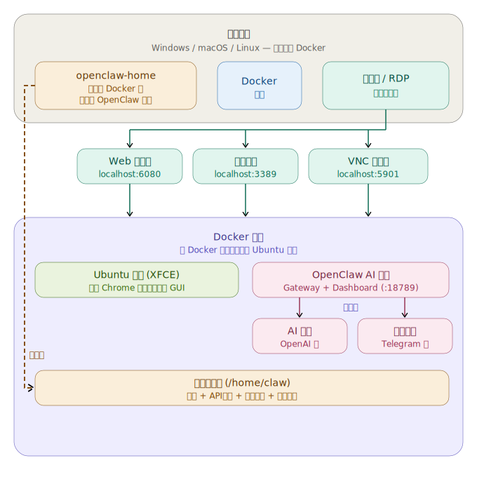

🌐 [English](README.md) | [한국어](README.ko.md) | [中文](README.zh.md) | [日本語](README.ja.md)

# OpenClaw Docker 桌面环境

一键式 Docker 配置，可在完整的 Ubuntu 24.04 GUI 桌面中运行 [OpenClaw](https://openclaw.ai/)，支持通过 Web 浏览器（NoVNC）、RDP 或 VNC 访问。

所有组件均已预装 — Node.js 22、OpenClaw、Google Chrome 以及默认 Gateway 配置。首次启动时 Gateway 自动运行，只需设置 AI 模型即可使用。

[](https://buymeacoffee.com/neoplanetz) [](https://ctee.kr/place/neoplanetz)

<p>
  
  
</p>

> **第一次使用 Docker？** 请查看[完全新手指南](docs/GUIDE_FOR_BEGINNERS.zh.md)，包含截图的分步说明。

## 架构

<p align="center">
  
</p>

## 包含组件

| 组件 | 详情 |
|-----------|---------|
| **基础系统** | Ubuntu 24.04 |
| **桌面环境** | XFCE4，含韩文 + CJK + Emoji 字体 |
| **远程访问** | TigerVNC + NoVNC（Web）、xRDP（远程桌面）、VNC |
| **浏览器** | Google Chrome（默认，`--no-sandbox` 包装器） |
| **运行时** | Node.js 22（NodeSource） |
| **OpenClaw** | npm 最新版，默认配置已预置，Gateway 自动启动 |
| **桌面快捷方式** | OpenClaw 设置、仪表板、终端 |

## 端口

| 端口 | 服务 |
|------|---------|
| `6080` | NoVNC — 通过 Web 浏览器访问桌面 |
| `5901` | VNC — VNC 客户端直连 |
| `3389` | RDP — Windows 远程桌面 / Remmina |
| `18789` | OpenClaw Gateway 与仪表板 |

## 快速开始

### 前提条件

- Docker Engine 20+

### 从 Docker Hub 运行（推荐）

```bash
docker compose up -d
```

或单独运行：
```bash
docker pull neoplanetz/openclaw-desktop-docker:latest
docker run -d --name openclaw-desktop \
  -p 6080:6080 -p 5901:5901 -p 3389:3389 -p 18789:18789 \
  --shm-size=2g --security-opt seccomp=unconfined \
  neoplanetz/openclaw-desktop-docker:latest
```

### 从源代码构建

如果您想自己构建镜像：
```bash
docker compose up -d --build
```

## 连接桌面

### Web 浏览器（NoVNC）

打开 `http://localhost:6080/vnc.html`，输入 VNC 密码（默认：`claw1234`，可在 `.env` 文件中修改）。

### RDP（远程桌面）

使用任意 RDP 客户端连接 `localhost:3389`：
- **Windows**：`mstsc`
- **macOS**：Microsoft Remote Desktop
- **Linux**：Remmina

使用配置的用户名和密码登录（默认：`claw` / `claw1234`，可在 `.env` 文件中修改）。域名留空。

### VNC 客户端

使用任意 VNC 查看器连接 `localhost:5901`。

## OpenClaw 设置

### 工作原理（无需手动安装）

Docker 镜像已包含 Node.js 22、OpenClaw 及最小化的 `~/.openclaw/openclaw.json` 配置。每次容器启动时，入口脚本会：

1. 启动 VNC、NoVNC 和 xRDP 服务器
2. 确认 OpenClaw 配置文件存在（缺失时重新生成）
3. 运行 `openclaw-sync-display` 配置 DISPLAY / XAUTHORITY 目标（自动检测 VNC 与 xRDP 会话），并在 `~/.openclaw/.env` 中设置 `OPENCLAW_ALLOW_INSECURE_PRIVATE_WS=1`
4. 在后台启动 OpenClaw Gateway（`openclaw gateway run`）
5. 将 Chrome 设为 XFCE 默认浏览器
6. 安装 `.bashrc` 钩子，在 VNC 和 RDP 会话切换时自动同步显示

由于 Docker 没有 systemd，引导过程中的 Gateway 守护进程安装步骤会失败 — **这是正常的，可以安全忽略**。入口脚本直接管理 Gateway 进程。

### 桌面快捷方式

XFCE 桌面上放置了三个图标：

| 图标 | 功能 |
|------|-------------|
| **OpenClaw Setup** | 运行 `openclaw onboard` — 配置 AI 模型/认证、频道（Telegram、Discord 等）和技能。最后的 Gateway 守护进程安装失败是正常的。 |
| **OpenClaw Dashboard** | 运行 `openclaw dashboard` — 使用正确的 `localhost` URL 和自动登录令牌打开 Chrome。 |
| **OpenClaw Terminal** | 打开已准备好 `openclaw` CLI 的 XFCE 终端。 |

### 首次 AI 模型设置

双击桌面上的 **"OpenClaw Setup"**。引导向导会带您完成：

1. **模型 / 认证** — 选择提供商（OpenAI Codex OAuth、Anthropic API 密钥等）
2. **频道** — 连接 Telegram、Discord、WhatsApp 或跳过
3. **技能** — 安装推荐技能或跳过
4. **Gateway 守护进程** — 会失败（无 systemd）— 忽略即可

向导完成后会自动重启 Gateway 并打开仪表板。

#### OpenAI Codex OAuth（ChatGPT 订阅）

如果您有 ChatGPT Plus/Pro 订阅，请在引导过程中选择 **"OpenAI Codex (ChatGPT OAuth)"**。浏览器窗口将打开，供您登录 OpenAI 账户。授权后，模型会自动设置。

或在终端中直接运行：
```bash
openclaw models auth login --provider openai-codex --set-default
```

#### Anthropic API 密钥

```bash
openclaw config set agents.defaults.model.primary anthropic/claude-sonnet-4-6
echo 'ANTHROPIC_API_KEY=sk-ant-...' >> ~/.openclaw/.env
```

#### OpenAI API 密钥

```bash
openclaw config set agents.defaults.model.primary openai/gpt-4o
echo 'OPENAI_API_KEY=sk-...' >> ~/.openclaw/.env
```

### Gateway 管理

```bash
openclaw status              # 整体状态
openclaw gateway status      # Gateway 状态
openclaw models status       # 模型/认证状态
openclaw config get          # 查看当前配置
openclaw dashboard           # 使用自动登录令牌打开仪表板
```

## 配置

### 默认 `openclaw.json`

预置于 `~/.openclaw/openclaw.json`：

```json5
{
  gateway: {
    mode: "local",
    port: 18789,
    bind: "lan",
    controlUi: {
      allowedOrigins: ["*"],
    },
  },
  agents: {
    defaults: {
      workspace: "~/.openclaw/workspace",
    },
  },
  env: {
    vars: {
      TZ: "Asia/Seoul",
    },
  },
}
```

- `bind: "lan"` — 监听所有网络接口，使主机可通过 `http://localhost:18789/` 访问
- `controlUi.allowedOrigins: ["*"]` — 允许任何来源访问仪表板（Docker 内部需要）
- 默认未配置 AI 模型 — 通过引导向导或 CLI 设置

### 自定义用户名和密码

编辑项目根目录（与 `docker-compose.yml` 同一目录）中的 `.env` 文件：

```env
CLAW_USER=myname
CLAW_PASSWORD=mypassword
```

然后重新构建：
```bash
docker compose up -d --build
```

> 如果在之前运行后更改用户名，需要先删除旧的卷：
> `docker compose down -v && docker compose up -d --build`

### 环境变量

通过 `.env` 文件自动设置到 `docker-compose.yml`：

| `.env` 变量 | 容器环境变量 | 默认值 | 说明 |
|----------|---------|---------|-------------|
| `CLAW_USER` | `USER` | `claw` | Linux 用户名 |
| `CLAW_PASSWORD` | `PASSWORD` | `claw1234` | VNC / RDP / sudo 密码 |
| — | `VNC_RESOLUTION` | `1920x1080` | 桌面分辨率 |
| — | `VNC_COL_DEPTH` | `24` | 色深 |
| — | `TZ` | `Asia/Seoul` | 时区 |
| — | `OPENCLAW_ALLOW_INSECURE_PRIVATE_WS` | `1` | 允许对 Docker 内部私有 IP 使用明文 `ws://`（[详情](#docker-相关解决方案)） |
| `OPENCLAW_BROWSER_ENABLED` | `OPENCLAW_BROWSER_ENABLED` | `false` | 启用 OpenClaw CDP 浏览器（Chrome 配置文件：`openclaw`，`--no-sandbox`） |
| `OPENCLAW_DISPLAY_TARGET` | `OPENCLAW_DISPLAY_TARGET` | `auto` | 显示目标策略：`auto`、`vnc`、`rdp` |
| — | `OPENCLAW_X_DISPLAY` | — | DISPLAY 硬覆盖（例如：`:1`、`:10`） |
| — | `OPENCLAW_X_AUTHORITY` | — | XAUTHORITY 路径硬覆盖 |

## 数据持久化

`openclaw-home` 命名卷挂载到配置用户的主目录（默认：`/home/claw`）。以下内容会被保留：

- OpenClaw 配置、凭据和对话记录
- Chrome 配置文件和书签
- 桌面自定义设置
- SSH 密钥、Shell 历史记录等

数据在 `docker compose down` / `up` 后仍然保留。只有 `docker volume rm openclaw-home` 才会删除数据。

## Docker 相关解决方案

此环境包含多项解决方案，用于在 Docker 中运行完整的 GUI + 浏览器 + OpenClaw：

| 问题 | 解决方案 |
|-------|----------|
| 无 systemd | 入口脚本直接管理 VNC、xRDP 和 Gateway 进程 |
| Chrome 需要沙箱 | 包装脚本为每次启动添加 `--no-sandbox` |
| `xdg-open` 使用 Docker 内部 IP | 包装器将 `172.x.x.x` / `10.x.x.x` URL 重写为 `localhost` |
| 浏览器从终端分离 | xdg-open 包装器中的 `setsid` 防止终端关闭时的 SIGHUP |
| Chrome 配置文件锁冲突 | 容器启动时清理过期的 `SingletonLock` 文件 |
| XFCE 默认浏览器 | 每次启动时设置自定义 exo-helper + `mimeapps.list` |
| VNC 密码（缺少 `vncpasswd`） | 三级回退：`vncpasswd` 二进制 → `openssl` → 纯 Python DES |
| Docker 中 Firefox snap 无法使用 | 替换为 Google Chrome deb 包 |
| Gateway 健康检查阻止非回环 `ws://` | `OPENCLAW_ALLOW_INSECURE_PRIVATE_WS=1` 允许对 RFC 1918 私有 IP 使用明文 `ws://`（仅限 Docker 内部网络，[v2026.2.19 中添加](https://github.com/openclaw/openclaw/pull/28670)） |
| VNC↔RDP 显示不匹配 | `openclaw-sync-display` 助手自动检测活动会话（VNC `:1` vs xRDP `:10+`），使用正确的 DISPLAY 重启 Gateway；`.bashrc` 钩子捕获切换 |

## 故障排除

### 容器持续重启
```bash
docker compose logs openclaw-desktop
```
检查 VNC 启动或配置验证是否有错误。

### NoVNC 显示空白屏幕
```bash
# 如果在 .env 中更改了 CLAW_USER，请将 'claw' 替换为相应的用户名
docker exec -it openclaw-desktop bash
su - claw -c "vncserver -kill :1"
su - claw -c "vncserver :1 -geometry 1920x1080 -depth 24 -localhost no"
```

### RDP 显示白屏
```bash
docker exec -it openclaw-desktop /etc/init.d/xrdp restart
```

### OpenClaw Gateway 未运行
```bash
# 如果在 .env 中更改了 CLAW_USER，请将 'claw' 替换为相应的用户名
docker exec -u claw openclaw-desktop openclaw status
# 手动重启：
docker exec -u claw openclaw-desktop bash -c \
  "nohup openclaw gateway run >> ~/.openclaw/gateway.log 2>&1 & disown"
```

### 引导过程中出现 "Gateway daemon install failed"
这是正常的 — Docker 容器没有 systemd。入口脚本会代替管理 Gateway 生命周期。请忽略此消息。

### 仪表板显示 "control ui requires device identity"
浏览器使用了 Docker 内部 IP 而非 `localhost` 打开。关闭并使用 **"OpenClaw Dashboard"** 桌面快捷方式，它会使用正确的 URL 和令牌运行 `openclaw dashboard`。

## 文件结构

```
openclaw-desktop-docker/
├── .env                        # 用户配置（CLAW_USER、CLAW_PASSWORD）
├── Dockerfile                  # Ubuntu 24.04 基础镜像
├── docker-compose.yml          # Compose 配置
├── entrypoint.sh               # 运行时：VNC、xRDP、Chrome 配置、Gateway
├── README.md                   # 文档（EN、KO、ZH、JA）
├── assets/                     # 图片 & 架构图
│   ├── architecture_*.svg
│   ├── dockerized_openclaw.png
│   └── openclaw_desktop_web.png
├── configs/                    # 配置模板（构建/运行时复制）
│   ├── vnc/xstartup            # VNC 会话启动
│   ├── xrdp/startwm.sh        # xRDP 会话启动
│   ├── xrdp/reconnectwm.sh    # xRDP 重新连接钩子
│   └── ...
├── scripts/                    # 辅助脚本
│   └── openclaw-sync-display   # 基于策略的 X11 显示目标
└── docs/                       # 指南 & 更新日志
    ├── CHANGELOG.md
    ├── DOCKERHUB_OVERVIEW.md
    ├── GUIDE_FOR_BEGINNERS.*.md
    └── images/                 # 指南截图
```
