# OpenClaw Docker 完全新手指南

> 即使您对电脑不太熟悉也没关系。只需从头到尾按照本指南操作即可。

---

## 这是什么？

OpenClaw 是一个**在自己电脑上运行 AI 助手的程序**。

本项目将 OpenClaw 预先安装在一台**虚拟电脑**中。您可以把它想象成在电脑里再放一台小电脑。这台虚拟电脑通过**网页浏览器**（Chrome、Edge 等）进行访问和使用。

无需复杂的安装过程，只需几次点击即可立即使用 AI 助手环境。

---

## 准备工作

- 一台可以联网的电脑（Windows、Mac 或 Ubuntu）
- ChatGPT Plus/Pro 订阅（正在付费使用的 OpenAI 账户）**或** AI API 密钥

---

## 第一步：安装 Docker Desktop

> Docker 可以理解为"创建虚拟电脑的程序"。只需安装一次。

### 在 Windows 上安装

1. 在 Chrome 或 Edge 中打开以下地址：

   ```
   https://www.docker.com/products/docker-desktop/
   ```

2. 点击 **"Download for Windows"** 按钮。

3. 双击下载好的 **Docker Desktop Installer.exe** 文件。

4. 出现安装界面后，保持所有复选框不变，依次点击 **OK** → **Close** 完成安装。

5. **重启电脑。**（请务必执行此步骤！）

6. 重启后，从桌面或开始菜单启动 **Docker Desktop**。

7. 首次启动会出现用户协议同意界面，点击 **Accept**。

8. 如果提示登录，点击 **"Continue without signing in"**（不登录继续）或 **Skip** 即可。

9. 屏幕底部任务栏出现 Docker 图标（鲸鱼形状），并显示 **"Docker Desktop is running"** 时，表示已准备就绪。

### 在 Mac 上安装

1. 在 Safari 或 Chrome 中打开以下地址：

   ```
   https://www.docker.com/products/docker-desktop/
   ```

2. 点击 **"Download for Mac"** 按钮。
   - 需要选择是 **Apple 芯片 (M1/M2/M3/M4)** 还是 **Intel 芯片**。
   - 如果不确定：点击屏幕左上角的苹果图标 → **"关于本机"** 即可查看。显示"Apple M~"则为 Apple 芯片，显示"Intel"则为 Intel 芯片。

3. 双击下载好的 **Docker.dmg** 文件。

4. 将 Docker 图标拖拽到 **Applications** 文件夹。

5. 在 **Launchpad** 或**应用程序**文件夹中启动 **Docker**。

6. 如果出现"是否允许系统扩展？"之类的提示，点击**允许**。

7. 出现用户协议同意界面时，点击 **Accept**。

8. 如果提示登录，点击 **"Continue without signing in"** 或 **Skip** 即可。

9. 顶部菜单栏出现 Docker 图标（鲸鱼形状），并显示 **"Docker Desktop is running"** 时，表示已准备就绪。

### 在 Ubuntu 上安装

在 Ubuntu 上，使用终端命令安装 Docker，而不是 Docker Desktop。

1. 打开**终端**。（Ctrl + Alt + T）

2. 将以下命令**逐行复制**粘贴到终端中，每行后按 **Enter**：

   ```bash
   sudo apt-get update
   sudo apt-get install -y ca-certificates curl
   sudo install -m 0755 -d /etc/apt/keyrings
   sudo curl -fsSL https://download.docker.com/linux/ubuntu/gpg -o /etc/apt/keyrings/docker.asc
   sudo chmod a+r /etc/apt/keyrings/docker.asc
   ```

3. 接着运行以下命令：

   ```bash
   echo "deb [arch=$(dpkg --print-architecture) signed-by=/etc/apt/keyrings/docker.asc] https://download.docker.com/linux/ubuntu $(. /etc/os-release && echo "$VERSION_CODENAME") stable" | sudo tee /etc/apt/sources.list.d/docker.list > /dev/null
   sudo apt-get update
   sudo apt-get install -y docker-ce docker-ce-cli containerd.io docker-buildx-plugin docker-compose-plugin
   ```

4. 配置 Docker 以便**无需重启**即可立即使用：

   ```bash
   sudo usermod -aG docker $USER
   newgrp docker
   ```

5. 验证安装是否成功：

   ```bash
   docker --version
   ```

   如果显示类似 `Docker version 2x.x.x` 的内容，则表示已准备就绪。

---

## 第二步：下载项目文件

1. 从以下地址下载项目文件：

   ```
   https://github.com/neoplanetz/openclaw-desktop-docker
   ```

2. 点击绿色的 **"<> Code"** 按钮。

3. 点击 **"Download ZIP"**。

4. 解压下载的 ZIP 文件。
   - **Windows**：在下载文件夹中右键点击 ZIP 文件 → **"解压缩"** 或 **"全部提取"**
   - **Mac**：在下载文件夹中双击 ZIP 文件
   - **Ubuntu**：在下载文件夹中右键点击 ZIP 文件 → **"解压到此处"** 或在终端中运行 `unzip 文件名.zip`

5. 记住解压后的文件夹位置。（例如：名称类似 `openclaw-desktop-docker-main`）

---

## 第三步：启动虚拟电脑

### 在 Windows 上启动

1. 打开解压后的文件夹。

2. 在文件夹内的空白处按 **Shift + 鼠标右键** → 选择 **"在此处打开 PowerShell 窗口"** 或 **"在此处打开终端"**。

   > 如果看不到上述选项：
   > 1. 在开始菜单中搜索 **"PowerShell"** 并运行。
   > 2. 将以下命令中的路径替换为您自己的文件夹位置后输入：
   >    ```
   >    cd C:\Users\你的用户名\Downloads\openclaw-desktop-docker-main
   >    ```

3. 将以下命令**复制**并**粘贴**到终端中，然后按 **Enter**：

   ```
   docker compose up -d --build
   ```

4. 首次运行时会从网上下载所需文件。**可能需要 10~30 分钟。**（取决于网速）

5. 出现以下消息则表示成功：

   ```
   ✔ Container openclaw-desktop  Started
   ```

### 在 Mac 上启动

1. 打开解压后的文件夹。

2. 启动**终端** App。
   - Spotlight 搜索（Command + Space）→ 输入"终端"或"Terminal" → Enter

3. 在终端中输入 `cd `（cd 后面加一个空格），然后将 **Finder 中解压后的文件夹拖拽到终端窗口**，路径会自动填入。按 Enter。

   > 如果无法拖拽，请直接输入：
   > ```
   > cd ~/Downloads/openclaw-desktop-docker-main
   > ```

4. 将以下命令**复制**并**粘贴**到终端中，然后按 **Enter**：

   ```
   docker compose up -d --build
   ```

5. 首次运行时会从网上下载所需文件。**可能需要 10~30 分钟。**

6. 出现以下消息则表示成功：

   ```
   ✔ Container openclaw-desktop  Started
   ```

### 在 Ubuntu 上启动

1. 打开**终端**。（Ctrl + Alt + T）

2. 进入解压后的文件夹：

   ```bash
   cd ~/Downloads/openclaw-desktop-docker-main
   ```

3. 输入以下命令并按 **Enter**：

   ```
   docker compose up -d --build
   ```

4. 首次运行时会从网上下载所需文件。**可能需要 10~30 分钟。**

5. 出现以下消息则表示成功：

   ```
   ✔ Container openclaw-desktop  Started
   ```

---

## 第四步：访问虚拟电脑

虚拟电脑启动后，使用**您正在使用的网页浏览器**进行访问。

1. 打开 Chrome、Edge、Safari 等任意浏览器，在地址栏中输入：

   ```
   http://localhost:6080/vnc.html
   ```

2. 点击 **"Connect"** 按钮。

3. 如果提示输入密码，请输入默认密码：

   ```
   claw1234
   ```

   > 这是默认密码。您可以在 `.env` 文件中修改。

4. 虚拟电脑的桌面出现了！您可以像使用普通电脑一样，用鼠标和键盘进行操作。

---

## 第五步：设置 AI 模型（首次使用）

在虚拟电脑桌面上找到 **"OpenClaw Setup"** 图标，**双击**打开。

终端（黑色窗口）将打开，设置向导随即启动。请按照以下截图逐步操作。

> 以下示例以拥有 **ChatGPT Plus/Pro 订阅**为准。使用 API 密钥的流程也类似。

### 5-1. 开始引导


选择 **Yes**。

### 5-2. 选择 QuickStart

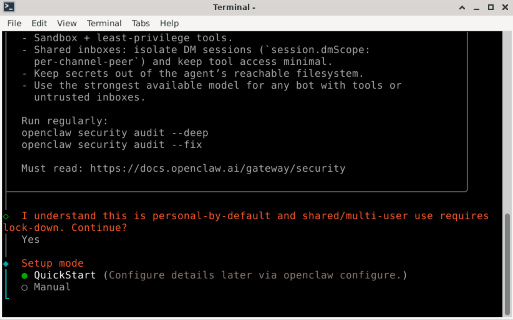

选择 **QuickStart**。

### 5-3. 更新设置值

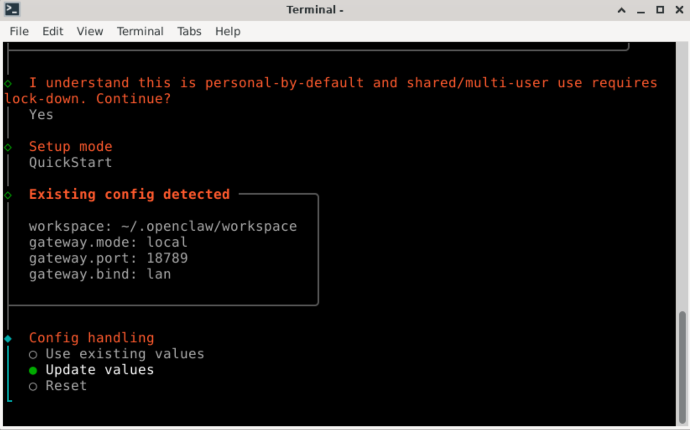

选择 **Update values**。

### 5-4. 选择 AI 提供商

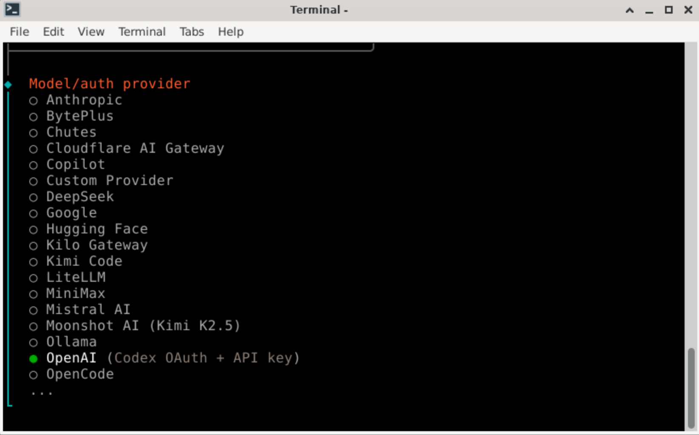

选择 **OpenAI**。

### 5-5. 选择认证方式


选择 **OpenAI Codex (ChatGPT OAuth)**。如果您有 ChatGPT Plus/Pro 订阅，无需单独的 API 密钥即可直接使用。

### 5-6. Chrome 登录弹窗


Chrome 浏览器打开后可能会出现登录弹窗。点击 **OK**，然后选择 **Don't Sign in**。（这里需要登录的是 OpenAI，而不是 Chrome 账户）

### 5-7. 登录 OpenAI


出现 OpenAI 登录界面时，使用**您在 ChatGPT 中使用的账户**登录，然后点击 **Continue**。

### 5-8. 认证完成


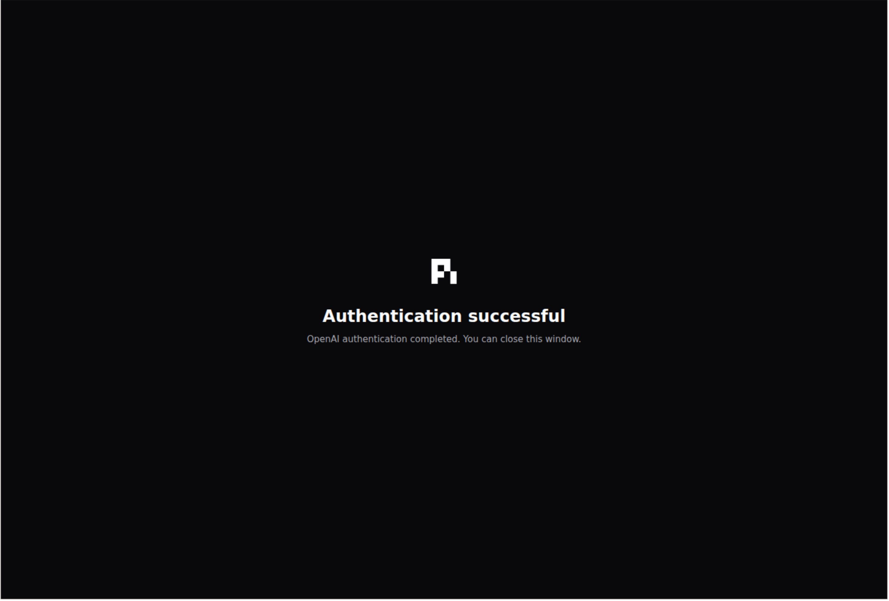

认证完成后会出现上图所示的界面。系统会自动进入下一步。

### 5-9. 选择默认模型

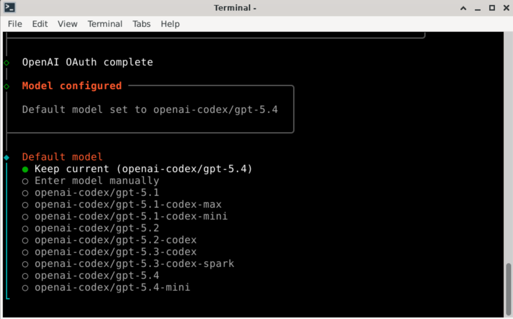

选择要使用的 AI 模型。如果不确定，**保持默认值**继续即可。

### 5-10. 连接频道（可选）


选择要连接的 Telegram、Discord 等通讯工具。**可以稍后再设置，跳过也没关系。**

这里以选择 Telegram 为例。

### 5-11. 输入 Telegram Bot Token（选择 Telegram 时）

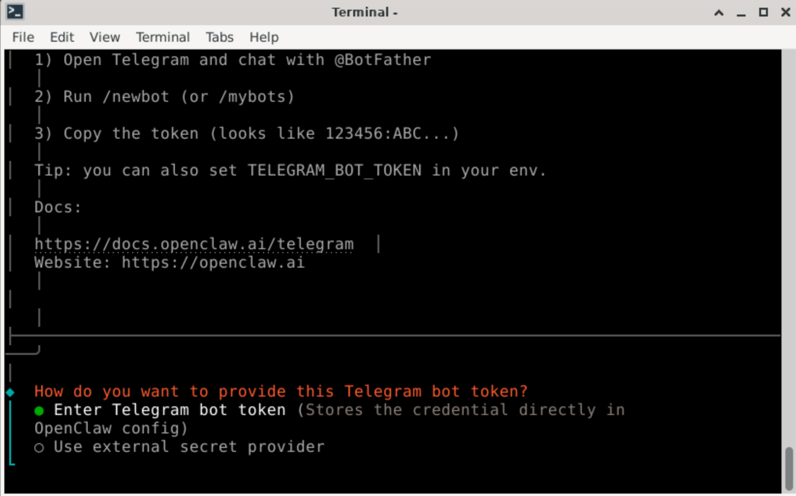

选择 **Enter Telegram bot Token**，然后输入您的 Telegram Bot Token。

> Telegram Bot Token 可以在 Telegram 中向 [@BotFather](https://t.me/BotFather) 发送 `/newbot` 命令来创建。

### 5-12. 选择其他 AI 提供商（可选）


可以额外添加其他 AI 提供商。不需要的话跳过即可。

### 5-13. 输入其他 API 密钥（可选）


如果选择了其他提供商，请输入对应的 API 密钥。不需要的话**直接按 Enter** 跳过。

### 5-14. 安装技能


系统询问是否安装技能。选择 **Yes**。

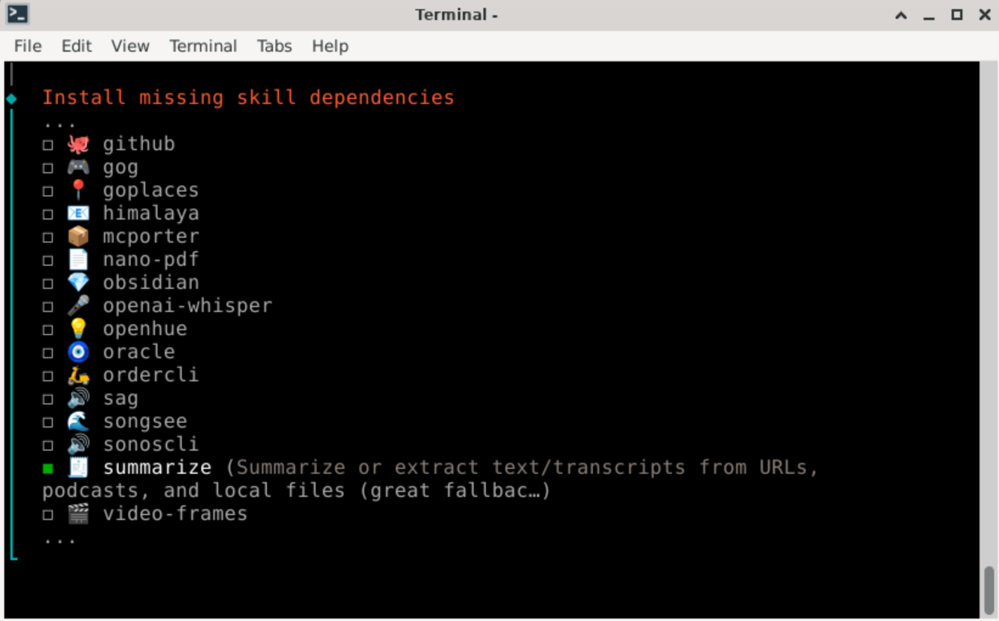

用**键盘空格键**选择想要的技能，然后按 **Enter** 进行安装。

### 5-15. 配置技能


系统询问是否进行技能配置。选择 **Yes**。


输入各技能所需的 API 密钥，或者选择 **No** 跳过不需要的部分。

### 5-16. 安装 Hook

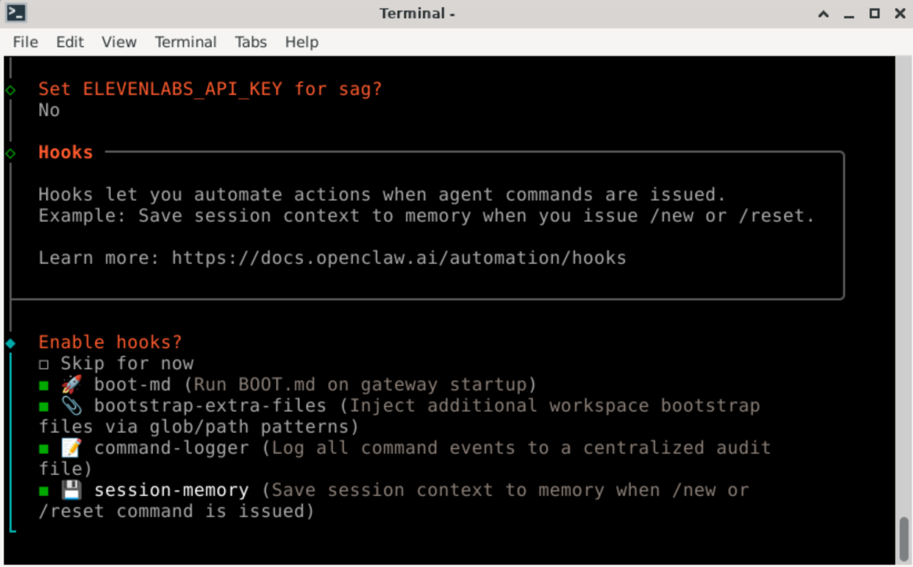

系统询问是否安装 Hook（自动化功能）。**建议全部选择安装。**

### 5-17. 安装 Gateway（可忽略）

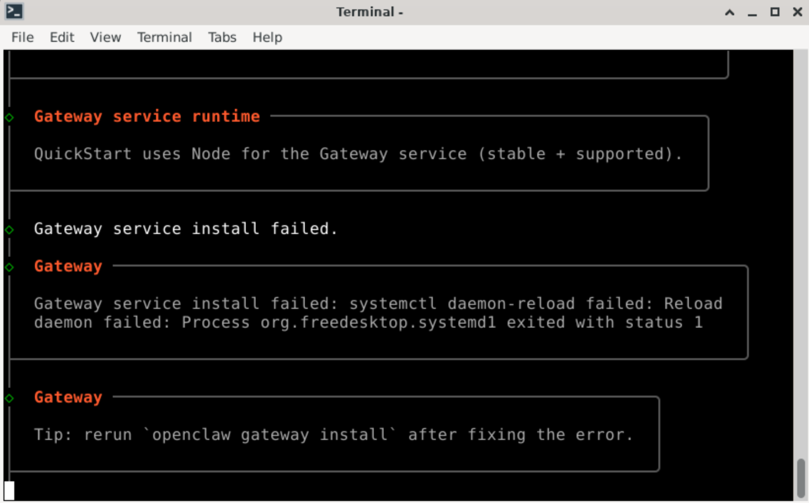

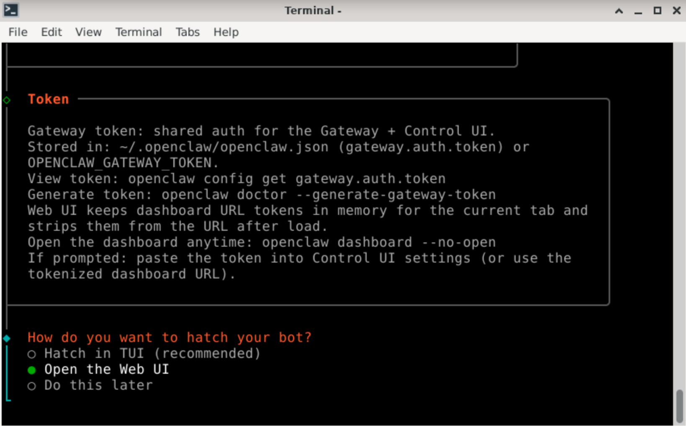

可能会出现"Gateway daemon install failed"的提示，但这是**正常现象，请忽略。** 选择 Open the Web UI，即可打开 OpenClaw Dashboard 界面。

### 5-18. 确认设置完成


在仪表盘的 Chat 界面中输入 **"Hi"** 试试。如果 AI 正常回复，则说明安装已完成！

---

## 第六步：连接 Telegram（已配置 Telegram 的情况下）

如果您设置了 Telegram 频道，需要批准与 Bot 的连接。

### 6-1. 在 Telegram 中向 Bot 发消息

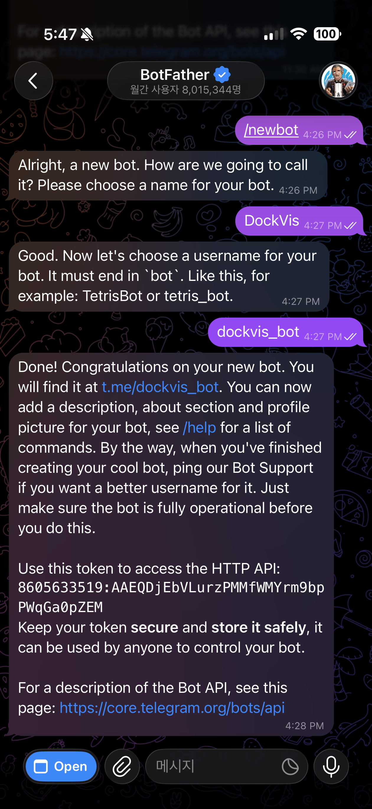


在 Telegram 中找到您的 Bot 并开始对话。Bot 会发送一个 **Pairing Code**（配对码）给您。

### 6-2. 批准 Pairing Code


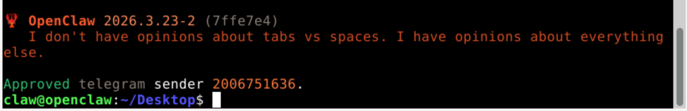

在虚拟电脑桌面上双击 **"OpenClaw Terminal"**，然后输入以下命令。将 `<pairing code>` 替换为您从 Telegram 收到的配对码。

```bash
openclaw pairing approve telegram <pairing code>
```

### 6-3. 通过 Telegram 开始对话


批准完成后，您就可以在 Telegram 中与自己的 AI Bot 对话了！

---

## 第七步：使用仪表盘

设置完成后，即可开始使用 OpenClaw！

### 打开仪表盘（管理界面）

双击虚拟电脑桌面上的 **"OpenClaw Dashboard"**，管理界面将在浏览器中打开。

或者，您也可以直接在本机浏览器中访问：

```
http://localhost:18789/
```

---

## 常见问题（FAQ）

### Q：出现"Gateway daemon install failed"错误

这是正常现象！请忽略此消息。这是虚拟电脑环境的特性导致的提示，实际上运行完全正常。

### Q：我想关闭虚拟电脑

在终端（PowerShell 或 Mac 终端）中进入项目文件夹后执行：

```
docker compose down
```

设置和数据会完整保留。重新启动时执行：

```
docker compose up -d
```

> 与第一次不同，这里没有 `--build`，所以会立即启动。

### Q：Docker Desktop 需要一直开着吗？

只需在使用虚拟电脑期间保持开启即可。关闭 Docker Desktop 后，虚拟电脑也会自动关闭。在 Ubuntu 上，Docker 作为系统服务运行，无需保持单独的应用程序开启。

### Q：虚拟电脑画面不显示

1. 确认 Docker Desktop 是否正在运行（任务栏/菜单栏中是否有鲸鱼图标）。
2. 在终端中使用以下命令检查状态：
   ```
   docker compose ps
   ```
   State 应显示为 **"running"**。
3. 如果仍然无法显示，使用以下命令重新启动：
   ```
   docker compose down
   docker compose up -d
   ```

### Q：密码是什么？

- 默认密码：`claw1234`
- 在虚拟电脑内提示输入管理员密码时也使用相同的密码
- 您可以通过编辑项目文件夹中的 `.env` 文件来更改用户名和密码，修改后运行 `docker compose up -d --build`

### Q：我想从头开始重新设置

1. 关闭虚拟电脑：
   ```
   docker compose down
   ```
2. 删除已保存的数据：
   ```
   docker volume rm openclaw-home
   ```
3. 重新启动：
   ```
   docker compose up -d
   ```

> **注意**：执行此操作后，虚拟电脑中保存的所有数据将被删除。

### Q：在浏览器中访问时显示"control ui requires device identity"

请双击虚拟电脑桌面上的 **"OpenClaw Dashboard"** 图标打开。直接在外部浏览器中输入地址可能会出现此错误。
